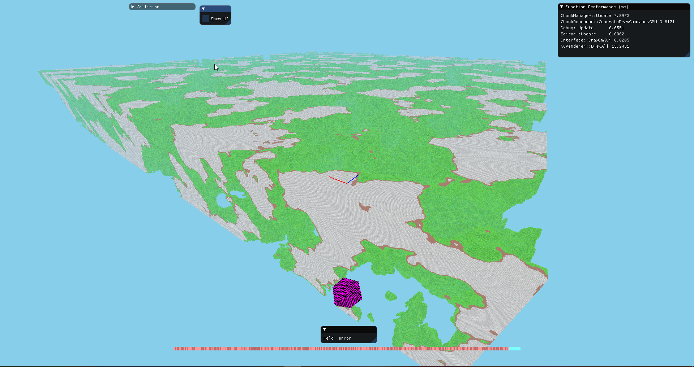
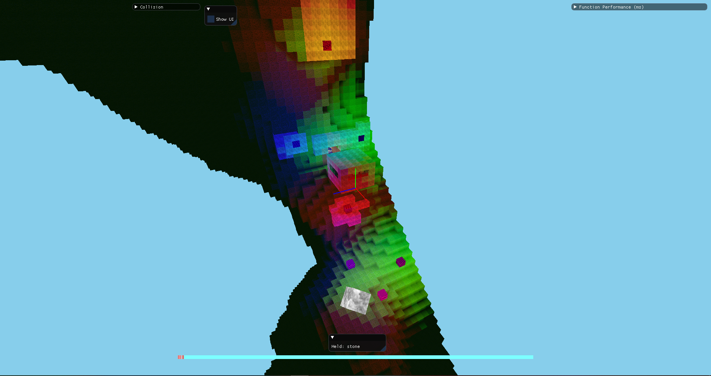
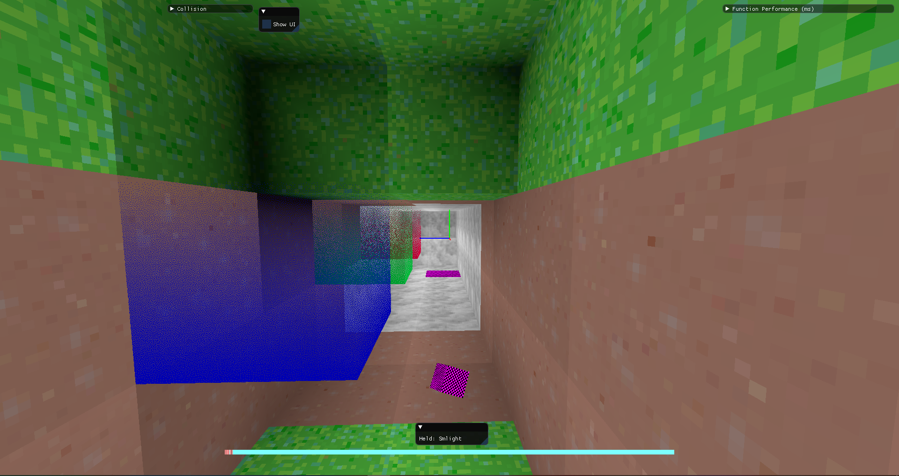

# Note: This project is no longer being actively worked on. Progress is being continued in [the repository for Gengine](https://github.com/JuanDiegoMontoya/Gengine).

# Voxel_Engine (Formerly 3D_Voxel_Engine)
Yet another voxel engine. Gallery at the bottom.

Tech demo demonstrating the implementation of various methods to optimize voxel rendering in a large and dynamic environment.

## Tech
The project is written in C++ and GLSL. Also used is OpenGL, GLM, GLFW for window handling, cereal for serialization, and libnoise/FastNoiseSIMD for procedural noise.  

Performance was tested on this system for reference:
- AMD Ryzen 5 2600X CPU
- 16GB DDR4 RAM
- NVIDIA GeForce GTX 1060 6GB

## Features
(*WIP*) indicates that a feature is mostly complete but has some bugs that need to be sorted out. 
### Voxels
- Capable of rendering a ~~270 million~~ 2 billion voxel world (56000+ chunks \* 323 cubes) with ~~30~~ 90-1500 FPS.
  - Culling aggressively reduces number of rendered chunks to just what is visible to the viewer.
- Movement physics and terrain collision
- Block destroying and placing
- A prefab editor
- Colored lighting

### Graphics
- GPU-driven renderer with little CPU synchronization
  - GPU generates draw commands
  - GPU performs frustum & raster culling
- Modern AZDO principles
  - Texture arrays for block textures
  - glMultiDrawArraysIndirectCount draws *all* chunks in a single call
  - Immutable buffer storage
- Chunk vertices consist of just two (packed) integers
- Raster-based occlusion culling
- Frustum culling of chunks
- Baked ambient occlusion on blocks

### Other
- Easily made portable- libraries would need to be rebuilt and a portable concurrent hash map would be needed
- Multithreaded mesh building and terrain generation
- Graphics effects can be toggled dynamically by the user

## In-Engine
### Controls
- WASD for camera movement, mouse for looking
- \` (Grave accent, left of '1' key) will toggle the mouse cursor so the user can interact with screen elements
- Mouse 1 (LMB) will remove the currently highlighted block on the screen
- Mouse 2 (RMB) will place a block of the type currently shown rotating on the bottom half of the screen
- Scrolling up or down will change the active block to place
- Left Shift will increase camera speed by 10 times
- Left Control will slow camera speed to 1/10th

#### Prefab Editing
- Tab will toggle the prefab editor menu
  - The most recently highlighted block will be highlighted in purple instead of white
  - Pressing 'F' will select the block and begin a region
    - Once three blocks have been selected, the region will be completed and will be encompassed by purple wireframe
  - Pressing the "save" button in the prefab menu will save the current region under the name written in the adjacent text box
  - Pressing the "load" button will generate a prefab of the given name in the adjacent box at the most recent highlighted purple position
  - Toggling the prefab editor (Tab x2) will reset the current region if a mistake has been made

## Notes (and FAQ?)
- There is no gameplay. That is because this is a tech demo/engine, not a game (yet).

## Building the Project
If you want to build this project, you'll need Visual Studio 2017 or later (earlier version might work).  
For the build configuration, use **Release** and **x64** (the other configurations aren't... configured).  
If I remembered to include all the necessary .dlls in git, then it should simply build and run.  
If you are (understandably) skeptical of the .dlls that come with this project, then you'll need to build or otherwise obtain them yourself. The current list of .dll or .lib dependencies (may be out of date) is:  
- glew 2.1.0
- glfw 3.3
- glm 0.9.9.0
- libnoise

## Gallery
Hover to see detail:

